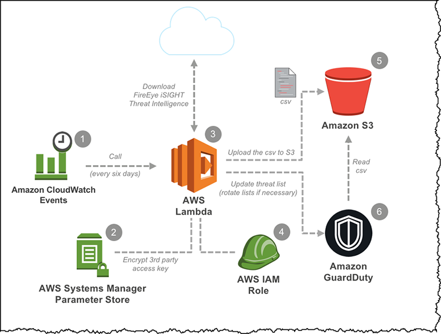

## Think Like an Attacker

Yesterday we covered what is DevSecOps, in this post we are going to look at some of the characteristics of an attacker. For us to think about the attacker we must think like an attacker. 

### Characteristics of an Attacker

First and foremost, all businesses and software is an attack vectors to an attacker, there is no safe place we can only make places safer and less attractive for people to attack. 

***[image from this source](https://www.trainerize.me/articles/outrun-bear/)***

With that in mind, attackers are a constant threat! 

Attackers will identify gaps in security by running attacks in a specific order to gain access, pull data and be successful in their mission. 

Attackers can be lucky, but they will absolutely work on targeted attacks. 

Compromises can be slow and persistent or fast to get to a breach. Not all attacks are going to be the same. 

### Motivations of an Attacker

As a DevOps team, you are going to be provisioning infrastructure, and software and protecting these environments likely spanning multiple clouds, virtualisation, and containerisation on platforms. 

We must consider the following: 

- **How** would they attack us? 
- **Why** would they attack us? 
- **What** do we have that is valuable to an attacker? 

The motivations of an attacker will also be different depending on the attacker. I mean it could just be for fun... We have probably all been there, in school and just gone a little too deep into the network looking for more information. Who has a story to tell? 

But as we have seen in the media attacks are more aligned to monetary, fraud or even political attacks on businesses and organisations. 

In the Kubernetes space, we have even seen attackers leveraging and using the computing power of an environment to mine cryptocurrency. 

At the heart of this attack is likely going to be **DATA** 

A company’s data is likely going to be extremely valuable to the company but also potentially out in the wild. It is why we put so much emphasis on protecting this data, ensuring that the data is secure and encrypted. 

### Attack Maps 

We now have a motive and some of the characteristics of an attacker or a group of attackers, if this is a planned attack then you are going to need a plan, you are going to need to identify what services and data you are targeting.

An attack map is a visual representation of an attack on a computer network. It shows the various stages of the attack, the tools and techniques used by the attacker, and the points of entry and exit into the network. Attack maps can be used to analyse the details of past attacks, identify vulnerabilities in a network, and plan defences against future attacks. They can also be used to communicate information about an attack to non-technical stakeholders, such as executives or legal teams.

You can see from the above description that an Attack Map should be created on both sides or both teams (teams wise this is something I am going to cover in a later post)

If you were to create an Attack Map of your home network or your business some of the things, you would want to capture would be: 

- Capture a graphical representation of your app including all communication flows and technologies being used. 

- A list of potential vulnerabilities and areas of attack.

- Consider confidentiality, integrity and availability for each connection/interaction within the app. 

- Map the attacks/vulnerabilities

An attack map might look something like this with a key explaining what each number represents. 

From this map we might consider there to be a denial of service or some malicious insider attack and access to S3 bucket to prevent the application saving data or causing it to save bad data. 

This map then is never final, in the same way that your application continouly moves forward through feedback, this attack map also needs to be tested against, which provides feedback which in turn means the security posture is strengthend against these attacks. You could call this "Continuous Response" in the Security Feedback loop. 

At a bare minimum we should be following a good, better, best model to better the security posture. 

- **Good** - Identify security design contraints and controls that need to be built into the software to reduce an attack. 

- **Better** - Prioritise and build security in for issues found later in the software cycle. 

- **Best** - Build automation into script deployment to detect issues, unit testing, security testing, black box testing

Security is a design constraint - albeit an inconvenient one.

## Resources 

- [devsecops.org](https://www.devsecops.org/)

- [TechWorld with Nana - What is DevSecOps? DevSecOps explained in 8 Mins](https://www.youtube.com/watch?v=nrhxNNH5lt0&list=PLsKoqAvws1pvg7qL7u28_OWfXwqkI3dQ1&index=1&t=19s)

- [What is DevSecOps?](https://www.youtube.com/watch?v=J73MELGF6u0&list=PLsKoqAvws1pvg7qL7u28_OWfXwqkI3dQ1&index=2&t=1s)

- [freeCodeCamp.org - Web App Vulnerabilities - DevSecOps Course for Beginners](https://www.youtube.com/watch?v=F5KJVuii0Yw&list=PLsKoqAvws1pvg7qL7u28_OWfXwqkI3dQ1&index=3&t=67s)

- [The Importance of DevSecOps and 5 Steps to Doing it Properly (DevSecOps EXPLAINED)](https://www.youtube.com/watch?v=KaoPQLyWq_g&list=PLsKoqAvws1pvg7qL7u28_OWfXwqkI3dQ1&index=4&t=13s)

- [Continuous Delivery - What is DevSecOps?](https://www.youtube.com/watch?v=NdvMUcWNlFw&list=PLsKoqAvws1pvg7qL7u28_OWfXwqkI3dQ1&index=5&t=6s)

- [Cloud Advocate - What is DevSecOps?](https://www.youtube.com/watch?v=a2y4Oj5wrZg&list=PLsKoqAvws1pvg7qL7u28_OWfXwqkI3dQ1&index=6)

- [Cloud Advocate - DevSecOps Pipeline CI Process - Real world example!](https://www.youtube.com/watch?v=ipe08lFQZU8&list=PLsKoqAvws1pvg7qL7u28_OWfXwqkI3dQ1&index=7&t=204s)

See you on [Day 4](day04.md) 