# Day 9: SAST Implementation with SonarCloud

SonarCloud is a cloud-based platform that provides static code analysis to help developers find and fix code quality issues in their projects. It is designed to work with a variety of programming languages and tools, including Java, C#, JavaScript, and more.

SonarCloud offers a range of features to help developers improve the quality of their code, including:

- **Static code analysis**: SonarCloud analyzes the source code of a project and checks for issues such as coding style violations, potential bugs, security vulnerabilities, and other problems. It provides developers with a detailed report of the issues it finds, along with suggestions for how to fix them.
- **Code review**: SonarCloud integrates with code review tools like GitHub pull requests, allowing developers to receive feedback on their code from their peers before it is merged into the main branch. This helps to catch issues early on in the development process, reducing the risk of bugs and other issues making it into production.
- **Continuous integration**: SonarCloud can be integrated into a continuous integration (CI) pipeline, allowing it to automatically run static code analysis on every code commit. This helps developers catch issues early and fix them quickly, improving the overall quality of their codebase.
- **Collaboration**: SonarCloud includes tools for team collaboration, such as the ability to assign issues to specific team members and track the progress of code review and issue resolution.
- **Customization**: SonarCloud allows developers to customize the rules and configurations used for static code analysis, so they can tailor the analysis to fit the specific needs and coding standards of their team.

Overall, SonarCloud is a valuable tool for developers looking to improve the quality of their code and reduce the risk of issues making it into production. It helps teams collaborate and catch problems early on in the development process, leading to faster, more efficient development and fewer bugs in the final product.

Read more about SonarCloud [here](https://docs.sonarcloud.io/)

### Integrate SonarCloud with GitHub Actions

- Sign up for a [SonarCloud](https://sonarcloud.io/) account with your GitHub Account.
- From the dashboard, click on “Import an organization from GitHub”
    
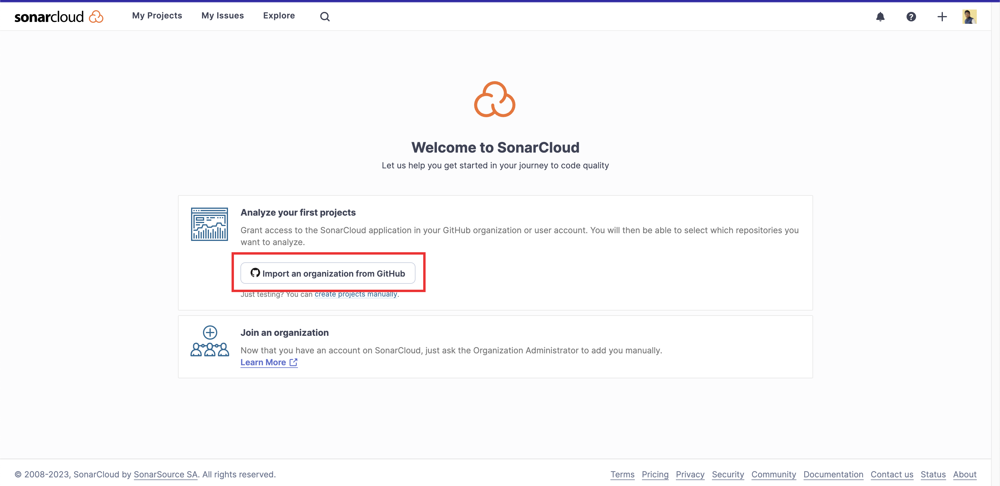
    
- Authorise and install SonarCloud app to access your GitHub account.
    
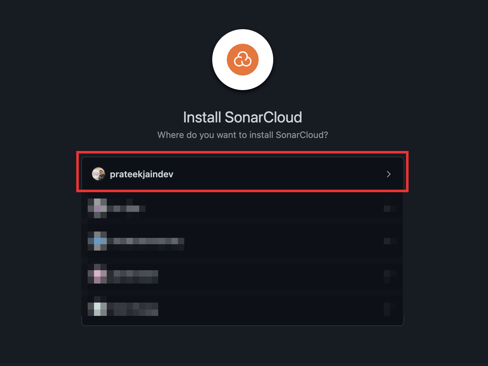
    
- Select the repository (free tier supports only public repositories) you want to analyze and click "Install"
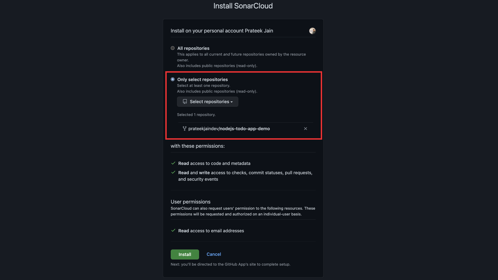
    
- In SonarCloud you can now create an organisation.

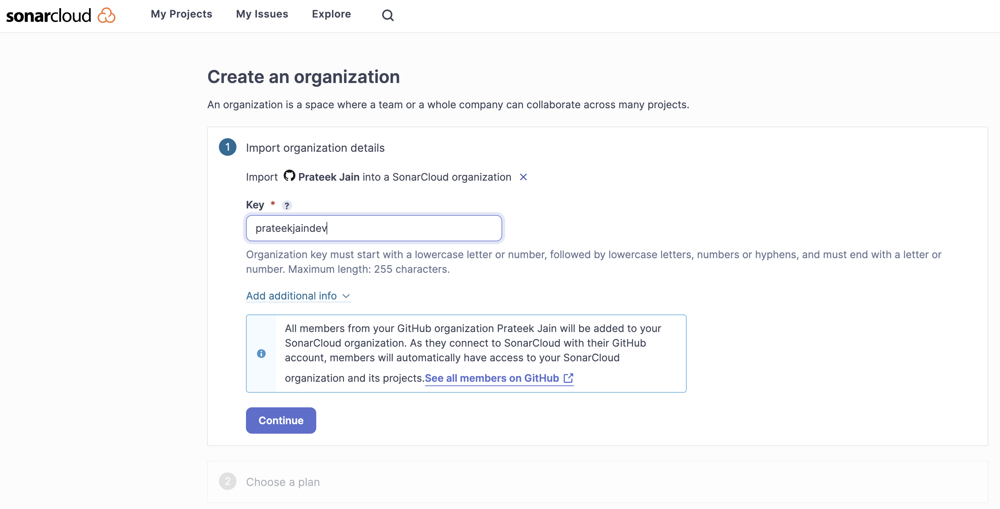
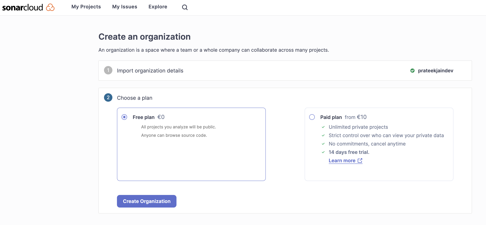

- Now click on “Analyze a new Project”

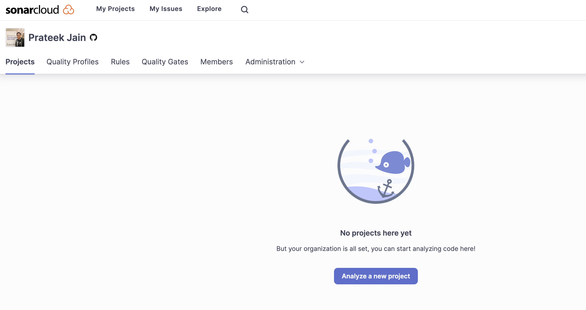

- Click on setup to add the Project.

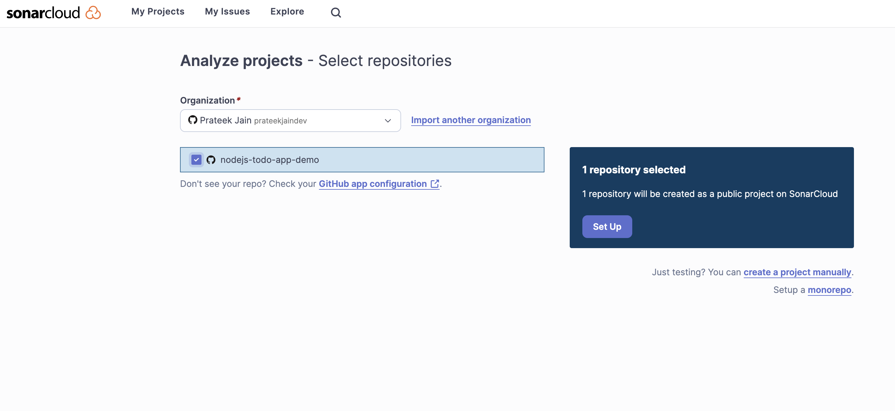

- Now on the SonarCloud dashboard you can the project.

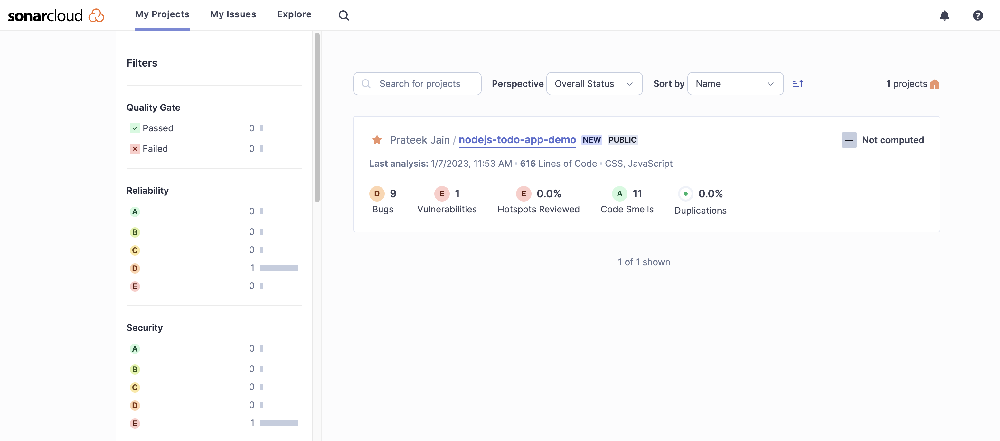

- To setup the GitHub Actions, click on the project, then on **Information** > **Last analysis method**


- Click on **GitHub Actions**

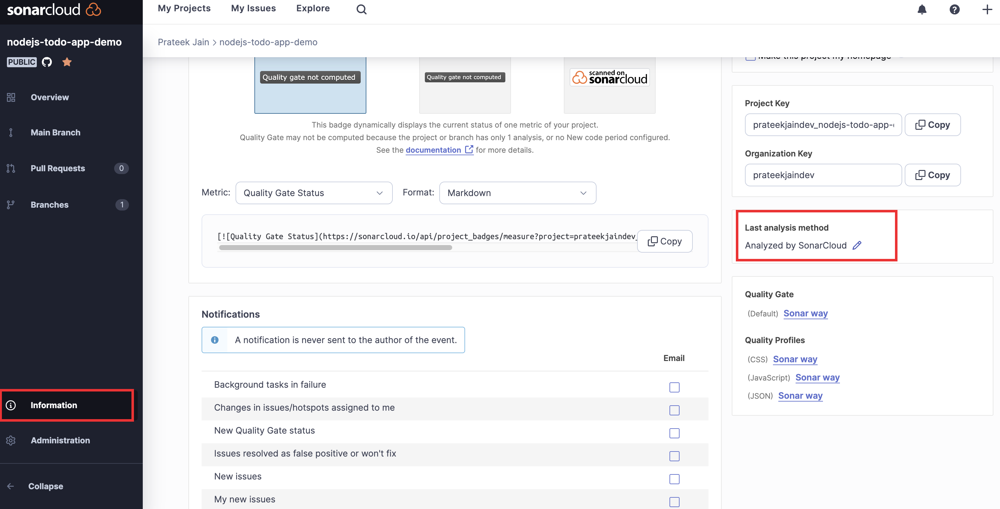

- This will show some steps to integrate SonarCloud with GitHub actions. At the top you will see SONAR_TOKEN, we will add that as Github Secrets later.

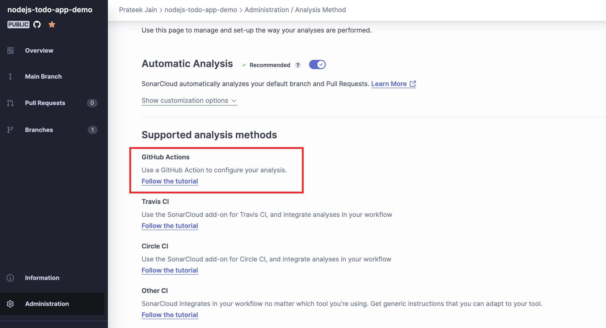

- Next thing you will see is the yaml file for the GitHub Workflow


- You will also see a configuration file that we wil have to add in the source code repo

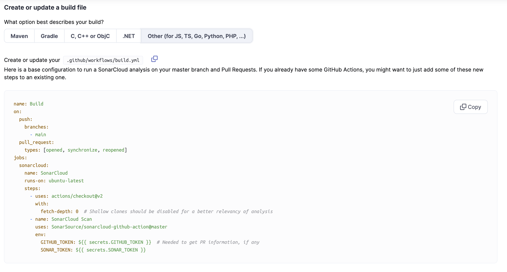

- At the bottom of page, disable the Automatic Analysis

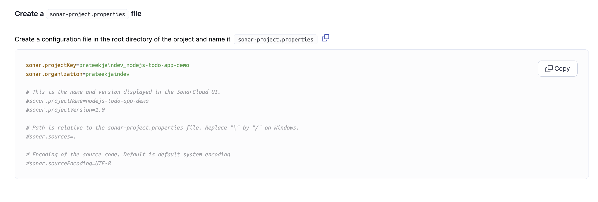
- Now go to GitHub and add GitHub Secret named SOANR_TOKEN.

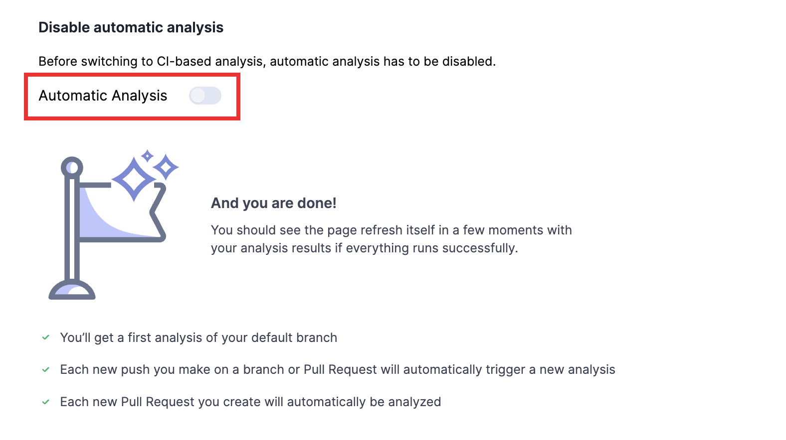

- Add the following configuration in the root directory.

```yaml
sonar.projectKey=prateekjaindev_nodejs-todo-app-demo
sonar.organization=prateekjaindev

# This is the name and version displayed in the SonarCloud UI.
#sonar.projectName=nodejs-todo-app-demo
#sonar.projectVersion=1.0

# Path is relative to the sonar-project.properties file. Replace "\" by "/" on Windows.
#sonar.sources=.

# Encoding of the source code. Default is default system encoding
#sonar.sourceEncoding=UTF-8
```

- Update or add the GitHub actions workflow with the following job.

```yaml
name: SonarScan
on:
  push:
    branches:
      - main
  pull_request:
    types: [opened, synchronize, reopened]
jobs:
  sonarcloud:
    name: SonarCloud
    runs-on: ubuntu-latest
    steps:
      - uses: actions/checkout@v2
        with:
          fetch-depth: 0  # Shallow clones should be disabled for a better relevancy of analysis
      - name: SonarCloud Scan
        uses: SonarSource/sonarcloud-github-action@master
        env:
           GITHUB_TOKEN: ${{ secrets.GITHUB_TOKEN }}  # Needed to get PR information, if any
          SONAR_TOKEN: ${{ secrets.SONAR_TOKEN }}
```
 
- As soon as you commit the changes, the workflow will trigger.

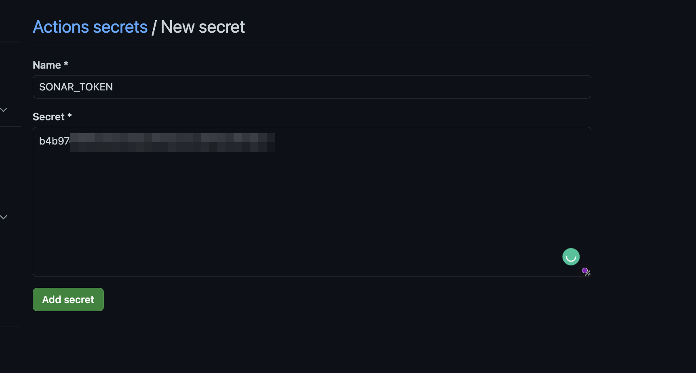

- Now after every commit, you can check the updated reports on the SonarCloud dashboard.

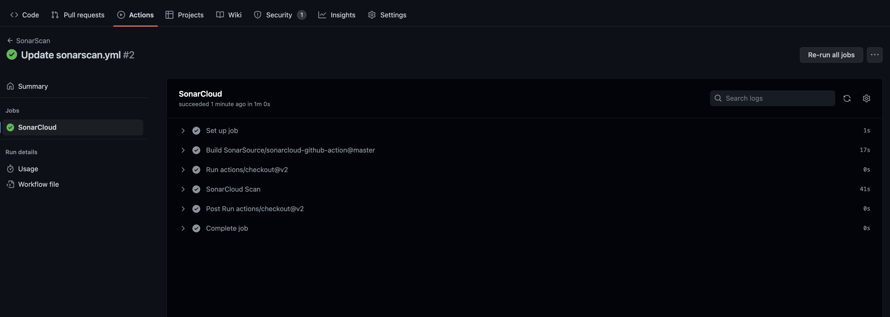

### Quality Gates

A quality gate is an indicator that tells you whether your code meets the minimum level of quality required for your project. It consists of a set of conditions that are applied to the results of each analysis. If the analysis results meet or exceed the quality gate conditions then it shows a **Passed** status otherwise, it shows a **Failed** status.

By default SonarCloud comes with a default quality gate “Sonar way”. You can edit or create new one in the Organisation Settings.

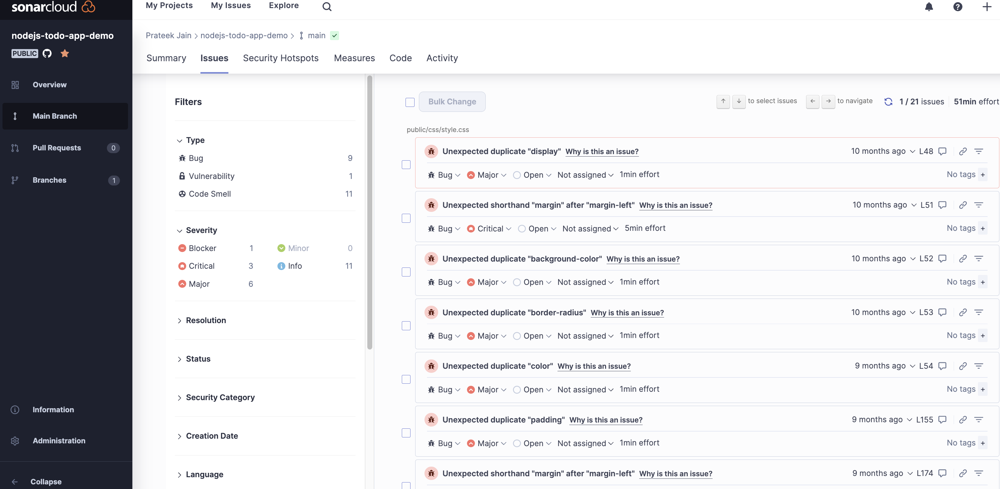

### Resources

- [SonarCloud Documentation](https://docs.sonarcloud.io/)
- [How to create Quality gates on SonarQube](https://www.youtube.com/watch?v=8_Xt9vchlpY)

In the next part [Day 10](day10.md), we will discuss Software Composition Analysis (SCA).